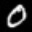
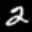
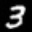
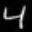
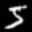
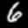
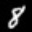
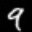

#一、开发环境
	python2.7+ or python3.6+
	opencv2.4+ or opencv3+
	
#二、项目介绍
    这是一个通用的svm模型训练平台。
	基于svm完成各种分类任务，比如数字识别、眨眼检测、美瞳检测、活体检测等。    	
	可以通过feature_extractor模块自定义人工特征，比如lbp、hog、颜色纹理特征等。    
	config模块用于配置人工特征类型、svm参数、数据路径等。  

**Todo**: 基于当前框架，升级成通用的机器学习模型训练平台，加入常用的机器学习分类算法：ANN、Logistic Regression等。

#三、训练步骤
（1）配置save_imagepath.train.sh和save_imagepath.test.sh的数据路径   
	&emsp;&emsp;在config中生成imagepath list：  
	&emsp;&emsp;$ sh save_imagepath.train.sh  
	&emsp;&emsp;$ sh save_imagepath.test.sh  
	
（2）修改config.json中的参数  
	&emsp;&emsp;data  
	&emsp;&emsp;svm  
	&emsp;&emsp;train_label_listfile  
	&emsp;&emsp;test_label_listfile  
	 
（3）模型训练  
    &emsp;&emsp;$ python svm_train.py  './config/blink_detect.48x32/config.json'   
    &emsp;&emsp;或者运行run.sh脚本   
	&emsp;&emsp;模型将保存在model目录下	
***
#四、示例一: 眨眼检测项目
##（1）项目说明
&emsp;&emsp;若在一段视频中检测到睁开的眼睛以及闭合的眼睛，则认为检测到眨眼动作。
问题可以转化为眼睛状态分类问题，即对睁开的眼睛与闭合的眼睛进行分类。
需要采集不同姿势不同光照情况下睁开的眼睛以及闭合的眼睛。示例项目的训练样本2000，测试样本1000。

open_eye:
  

close_eye:

##（2）配置
{  
  &ensp;"description":   
  &ensp;{   
    &ensp;&ensp;"version" : 1.0,   
    &ensp;&ensp;"object label_listfile" : "label_listfile means label and listfile which includes imagepaths.",   
    &ensp;&ensp;"object svm" : "svm config.",  
    &ensp;&ensp;"class num limits" : "no"  
  &ensp;},  
  &ensp;"data":  
  &ensp;{  
    &ensp;&ensp;"image_channel": 1,  
    &ensp;&ensp;"feature_type": "hog_cv2.48x32"  
  &ensp;},  
  &ensp;"svm":  
  &ensp;{  
    &ensp;&ensp;"model_name": "model/blink_detect.48x32.binary.xml",  
    &ensp;&ensp;"kernel" : "linear",  
    &ensp;&ensp;"autotrain": true,  
    &ensp;&ensp;"binary_classify": true,  
    &ensp;&ensp;"c": 2.67,  
    &ensp;&ensp;"gamma": 5.383  
  &ensp;},  
  &ensp;"train_label_listfile":  
  &ensp;{  
    &ensp;&ensp;"1":    
    &ensp;&ensp;[    
      &ensp;&ensp;&ensp;"./config/blink_detect.48x32/train/class1.lst"    
    &ensp;&ensp;]  
    &ensp;&ensp;"2":  
    &ensp;&ensp;[  
      &ensp;&ensp;&ensp;"./config/blink_detect.48x32/train/class2.lst"  
    &ensp;&ensp;]    
  &ensp;},  
  &ensp;"test_label_listfile":  
  &ensp;{  
    &ensp;&ensp;"1":  
    &ensp;&ensp;[  
      &ensp;&ensp;&ensp;"./config/blink_detect.48x32/test/class1.lst"  
    &ensp;&ensp;],  
    &ensp;&ensp;"2":  
    &ensp;&ensp;[  
      &ensp;&ensp;&ensp;"./config/blink_detect.48x32/test/class2.lst"  
    &ensp;&ensp;]  
  &ensp;}  
}  

##（3）训练与测试结果:
[train] load data ...  
svm training...  
data config: {'image_channel': 1, 'feature_type': 'hog_cv2.48x32'}  
svm config: {'model_name': 'model/blink_detect.48x32.binary.xml', 'kernel': 'linear', 'autotrain': True, 'binary_classify': True, 'c': 2.67, 'gamma': 5.383}  
train auto  
data dims = 324  
class_num = 2  
labels = [1, 2]  
total_count = [10, 10]  
error_count = [0, 0]  
accurate = [ 1.  1.]  
total accurate = 1.0  

[test] load data ...  
svm testing...  
model_name: model/blink_detect.48x32.binary.xml  
data dims = 324  
class_num = 2  
labels = [1, 2]  
total_count = [10, 10]  
error_count = [0, 0]  
accurate = [ 1.  1.]  
total accurate = 1.0  

***
#五、示例二: 手写体数字识别项目    
##（1）项目说明
&emsp;&emsp;使用mnist数据库的部分数据。示例项目的训练样本2400，测试样本2400。

##（2）训练与测试结果:
python3.6.1  
opencv3.4.1  
[train] load data ...  
svm training...  
data config: {'image_channel': 1, 'feature_type': 'hog_cv2.32x32'}  
svm config: {'model_name': 'model/digits.32x32.svm_hog.xml', 'kernel': 'linear', 'autotrain': True, 'binary_classify': False, 'c': 2.67, 'gamma': 5.383}  
train auto  
data dims = 324  
class_num = 10  
labels = [0, 1, 2, 3, 4, 5, 6, 7, 8, 9]  
total_count = [250, 250, 250, 150, 250, 250, 250, 250, 250, 250]  
error_count = [1, 2, 1, 4, 3, 2, 1, 2, 3, 4]  
accurate = [ 0.99599999  0.99199998  0.99599999  0.97333336  0.98799998  0.99199998
  0.99599999  0.99199998  0.98799998  0.98400003]  
total accurate = 0.9904166460037231  

[test] load data ...  
svm testing...  
model_name: model/digits.32x32.svm_hog.xml  
data dims = 324  
class_num = 10  
labels = [0, 1, 2, 3, 4, 5, 6, 7, 8, 9]  
total_count = [250, 250, 250, 350, 250, 250, 250, 250, 250, 250]  
error_count = [1, 5, 7, 16, 4, 1, 2, 10, 16, 6]  
accurate = [ 0.99599999  0.98000002  0.972       0.95428574  0.98400003  0.99599999
  0.99199998  0.95999998  0.93599999  0.97600001]  
total accurate = 0.9738461375236511  

